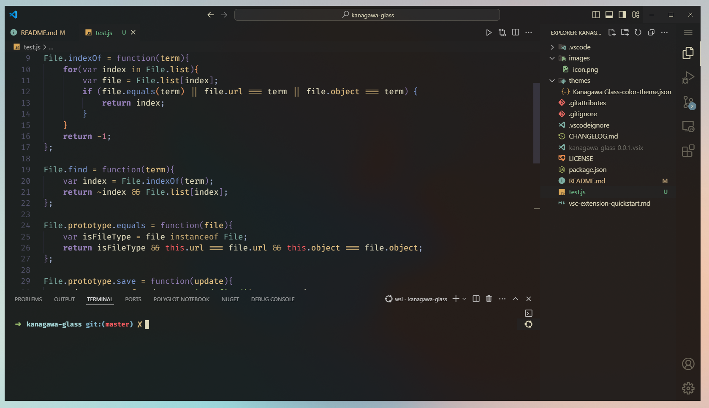

# Kanagawa Glass

Slightly altered version of [Kanagawa](<https://github.com/barklan/kanagawa.vscode>) for use with [Vibrancy](https://marketplace.visualstudio.com/items?itemName=eyhn.vscode-vibrancy). Heavily inspired by Jack-LP's [gruvbox-glass](https://github.com/Jack-LP/gruvbox-glass)

## Theme Screenshots

With [Vibrancy](https://marketplace.visualstudio.com/items?itemName=eyhn.vscode-vibrancy)

## Acknowledgments

- [Vibrancy](https://marketplace.visualstudio.com/items?itemName=eyhn.vscode-vibrancy)
- [Kanagawa](https://github.com/barklan/kanagawa.vscode)
- [gruvbox-glass](https://github.com/Jack-LP/gruvbox-glass)
